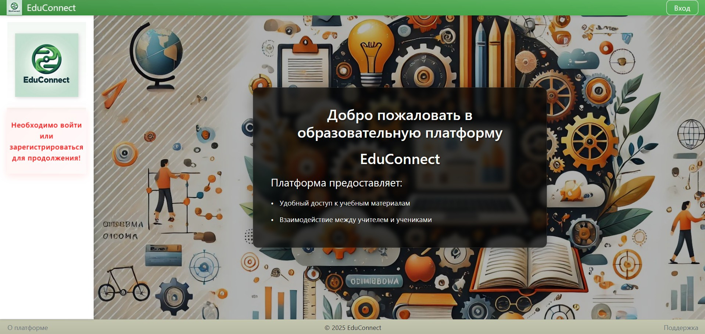

# EduConnect

EduConnect - это веб-платформа для организации образовательного процесса, обеспечивающая эффективное взаимодействие между учителями и учениками.

## Скриншоты

### Главная

*Главная страница*

### Панель учителя

*Панель управления учителя с возможностью загрузки материалов и управления учениками*

### Управление материалами

*Интерфейс управления учебными материалами с возможностью загрузки и распределения по предметам*

### Просмотр по классам

*Просмотр учеников по классам с информацией о предметах и материалах*

## Основные возможности

- 👨‍🏫 **Управление материалами**: Учителя могут загружать и управлять учебными материалами для разных предметов и классов
- 👥 **Работа с учениками**: Удобное управление списками учеников по предметам и классам
- 📚 **Организация материалов**: Структурированное хранение и доступ к учебным материалам
- 🔄 **Двусторонний обмен**: Возможность обмена материалами между учителями и учениками

## Технологии

### Frontend
- React.js
- Bootstrap
- CSS3 с современными анимациями
- Адаптивный дизайн

### Backend
- Django
- Django REST Framework
- SQLite3

## Установка и запуск

### Требования
- Python 3.8+
- Node.js 14+
- npm или yarn

### Backend

1. Создайте виртуальное окружение и активируйте его:
```bash
python -m venv venv
source venv/bin/activate  # для Linux/Mac
venv\Scripts\activate     # для Windows
```

2. Установите зависимости:
```bash
pip install -r requirements.txt
```

3. Примените миграции:
```bash
cd backend
python manage.py migrate
```

4. Запустите сервер:
```bash
python manage.py runserver
```

### Frontend

1. Перейдите в директорию frontend:
```bash
cd frontend
```

2. Установите зависимости:
```bash
npm install
```

3. Запустите приложение:
```bash
npm start
```

## Структура проекта

```
educonnect/
├── backend/           # Django backend
│   ├── api/          # REST API endpoints
│   ├── core/         # Core application logic
│   └── manage.py     # Django management script
├── frontend/         # React frontend
│   ├── public/      # Static files
│   ├── src/         # Source code
│   └── package.json # Node.js dependencies
├── requirements.txt  # Python dependencies
└── README.md        # Project documentation
```

## Лицензия

MIT License - см. файл [LICENSE](LICENSE) 